# 服务治理为何选择SpringCloud

[TOC]

# 什么是单体应用架构

什么是单体应用架构

* 所有的功能全部堆积在一起

# 单体应用架构存在的问题

单体应用架构存在的问题

* 开发体验差

* 维护成本高

* 部署效率低

* 扩展能力差   

不够灵活、维护成本高、部署效率低、扩展能力差

很难快起来   快速发布新功能    支持高并发和大数据 

单一应用 

垂直拆分

分布式服务

SOA面向服务架构

微服务架构

# 什么是微服务

什么是微服务

一种架构风格

* 服务之间使用HTTP的API进行资源访问与操作

每个小型服务可独立部署

* 可以采用不同的语言进行开发

* 可以使用不同的数据库进行数据存储

随着业务高速发展，微服务架构顺势而出。它将传统的单体应用划分为小型的服务单元，服务之间使用遵循 HTTP 的 API 进行资源访问与操作。

每个小型服务可以独立部署，可 以采用不同的语言进行开发，可以使用不同的数据库进行数据存储。

微服务 分布式 缓存  异步

高可用 高性能  安全性 

快速发布新功能、支持高并发和大数据

技术社区网站单体应用架构    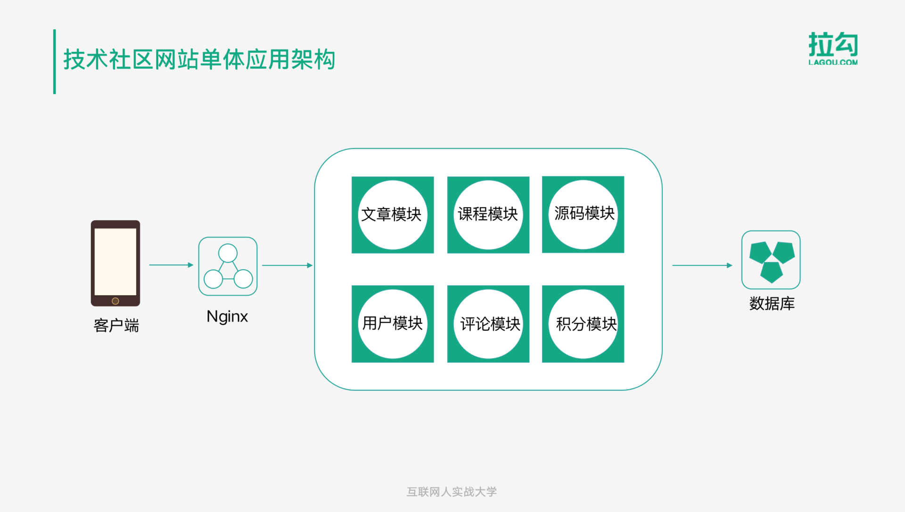    

 以技术社区网站为例，可以看到在单体应用程序架构图中，文章、课程、源码、用户等模块都是在一个项目中。从客户端请求到 Nginx， Nginx 再转发到后端服务，整个网站所有的功能模块都部署在一起。

客户端请求  Nginx 转发 后端服务    所有的功能模块都部署在一起 

技术社区网站微服务架构   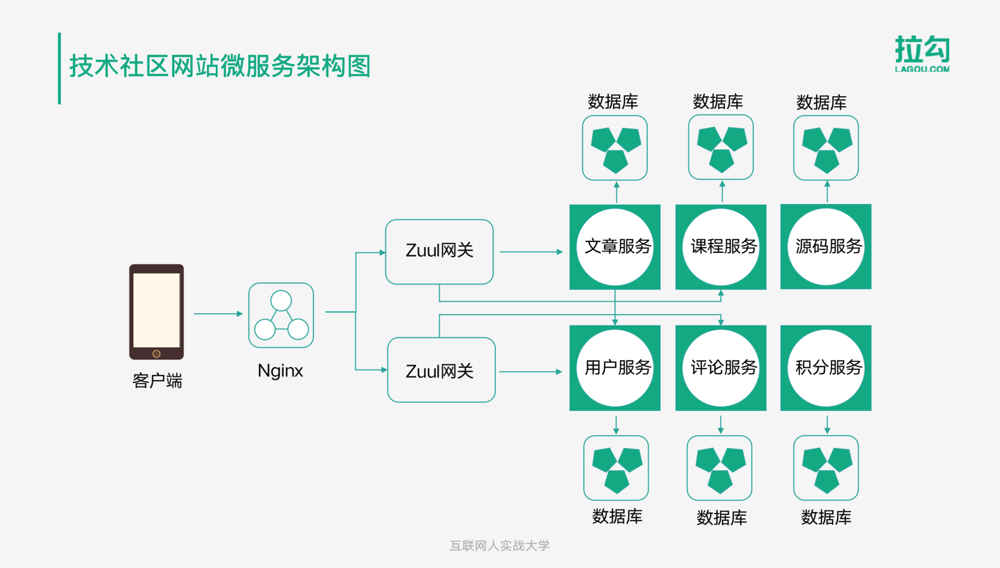    

 RPC 远程过程调用 

客户端 Nginx  Zuul网关 

文章  课程 源码 用户  评论 积分 服务  数据库   

重构成微服务架构后，在 Nginx 后面不再是具体的业务服务，而是网关，通过网关进行路由调用其他的业务服务。将原先的整个项目按照业务领域拆分成多个微服务，各自独立部署，服务之间通过 HTTP 接口进行远程调用。每个服务都有各自独立的数据库，相互隔离、互不影响。

重构成微服务架构后 在Nginx后面不再是具体的业务服务 而是网关

网关进行路由调用其他的业务服务 

HTTP接口进行远程调用   独立   

# 微服务的优点

微服务的优点

服务独立性

* 独立的代码仓库

* 独立的数据

* 独立的部署

开发体验好

* 启动速度更快
* 克隆代码速度快
* 编译部署速度快
* 技术选型更自由

按需扩容

* 服务根据消耗，选择内存大， CPU好的机器
* 只需部署这个服务

按需扩容，也就是说某个服务特别耗内存，可以单独部署在内存比较大的机器上；如果特别耗 CPU , 那可以部署到 CPU 比较好的机器上。且只需要部署这个服务，不需要像单体应用那样部署整个应用。

职责专一性

* 服务只负责本身的业务
* 团队分工方便

这样有利于实现不同的团队维护不同的服务。

微服务的特点：
单一职责：微服务中每一个服务都对应唯一的业务能力，做到单一职责
微：微服务的服务拆分粒度很小，例如一个用户管理就可以作为一个服务。每个服务虽小，但“五脏俱全”。
面向服务：面向服务是说每个服务都要对外暴露Rest风格服务接口API。并不关心服务的技术实现，做到与平台
和语言无关，也不限定用什么技术实现，只要提供Rest的接口即可。
自治：自治是说服务间互相独立，互不干扰
团队独立：每个服务都是一个独立的开发团队，人数不能过多。
技术独立：因为是面向服务，提供Rest接口，使用什么技术没有别人干涉
前后端分离：采用前后端分离开发，提供统一Rest接口，后端不用再为PC、移动端开发不同接口
数据库分离：每个服务都使用自己的数据源
部署独立，服务间虽然有调用，但要做到服务重启不影响其它服务。有利于持续集成和持续交付。每个服
务都是独立的组件，可复用，可替换，降低耦合，易维护
微服务架构与SOA都是对系统进行拆分；微服务架构基于SOA思想，可以把微服务当做去除了ESB的SOA。ESB是
SOA架构中的中心总线，设计图形应该是星形的，而微服务是去中心化的分布式软件架构。两者比较类似，但其实也有一些差别：

功能	SOA	微服务
组件大小	大块业务逻辑	单独任务或小块业务逻辑
耦合	通常松耦合	总是松耦合
管理	着重中央管理	着重分散管理
目标	确保应用能够交互操作	易维护、易扩展、更轻量级的交互

# 微服务的缺点

微服务的缺点

分布式带来的复杂性

* 远程调用
* 负载均衡
* 调用容错
* 依赖关系

服务拆分的复杂性

* 如何拆分
* 拆分后如何保证数据一致性

当一个业务操作涉及多个服务时，如何保证数据一致性.

运维的复杂性

* 服务数量多

* 服务节点多

* 日志的统一管理

* 服务的统一监控

2017年开始 SpringCloud在国内的普及度逐渐变高

2019年8月 Spring Cloud Alibab 发布助力Spring Cloud 的高速发展

**小结**：

**微服务架构**：是一套使用小服务或者单一业务来开发单个应用的方式或途径。

微服务架构特点：

- 单一职责
- 服务粒度小
- 面向服务（对外暴露REST api）
- 服务之间相互独立

与使用ESB的SOA架构的区别：微服务架构没有使用ESB，有服务治理注册中心；业务粒度小。

# SpringCloud VS Dubbo

SpringCloud VS Dubbo

微服务技术选型对比

SpringCloud

* 注册中心Eureka
* 负载均衡Ribbon
* 远程调用Feign Http
* 熔断机制Hystrix
* API网关Zuul
* 配置中心Config
* 链路跟踪Sleuth
* 服务管理SpringBoot Admin

Spring Cloud是Spring旗下的项目之一，官网地址：http://projects.spring.io/spring-cloud/
Spring最擅长的就是集成，把世界上最好的框架拿过来，集成到自己的项目中。Spring Cloud也是一样，它将现在非常流行的一些技术整合到一起，实现了诸如：配置管理，服务发现，智能路由，负载均衡，熔断器，控制总线，集群状态等功能；协调分布式环境中各个系统，为各类服务提供模板性配置。其主要涉及的组件包括：

Eureka：注册中心
Zuul、Gateway：服务网关
Ribbon：负载均衡
Feign：服务调用
Hystrix或Resilience4j：熔断器

以上只是其中一部分.

Spring Cloud不是一个组件，而是许多组件的集合；它的版本命名比较特殊，是以A到Z的为首字母的一些单词（其
实是伦敦地铁站的名字）组成：

我们在项目中，使用最新稳定的Greenwich版本。

Dubbo

* 注册中心Zookeeper
* 内置负载均衡
* Netty RPC
* 无熔断
* 无网关
* 无配置中心
* 无链路跟踪
* dubbo-admin

微服务的实现方式很多，但是最火的莫过于Spring Cloud了。为什么？

后台硬：作为Spring家族的一员，有整个Spring全家桶靠山，背景十分强大。
技术强：Spring作为Java领域的前辈，可以说是功力深厚。有强力的技术团队支撑，一般人还真比不了
群众基础好：可以说大多数程序员的成长都伴随着Spring框架，试问：现在有几家公司开发不用Spring？
Spring Cloud与Spring的各个框架无缝整合，对大家来说一切都是熟悉的配方，熟悉的味道。
使用方便：相信大家都体会到了SpringBoot给我们开发带来的便利，而Spring Cloud完全支持Spring Boot的开发，用很少的配置就能完成微服务框架的搭建

**小结**：

- 整合的组件可以有很多组件；常见的组件有：eureka注册中心，Gateway网关，Ribbon负载均衡，Feign服务调用，Hystrix熔断器。在有需要的时候项目添加对于的启动器依赖即可。
- 版本特征：以英文单词命名（伦敦地铁站名）

SpringCloud 社区活跃 组件齐全 使用方便

Dubbo 专注于服务治理 高性能

Dubbo更专注于服务治理这块，另一个优势就是性能非常高。而Spring Cloud的优势在于社区活跃，发布新功能的频率高，背靠Spring这个大家族，同时微服务场景需要的各种组件非常齐全，整合起来也非常简单。再加上2019年8月以来阿里巴巴的加持，相信未来几年国内互联网公司的分布式系统开发一定是 Spring Cloud 的天下。

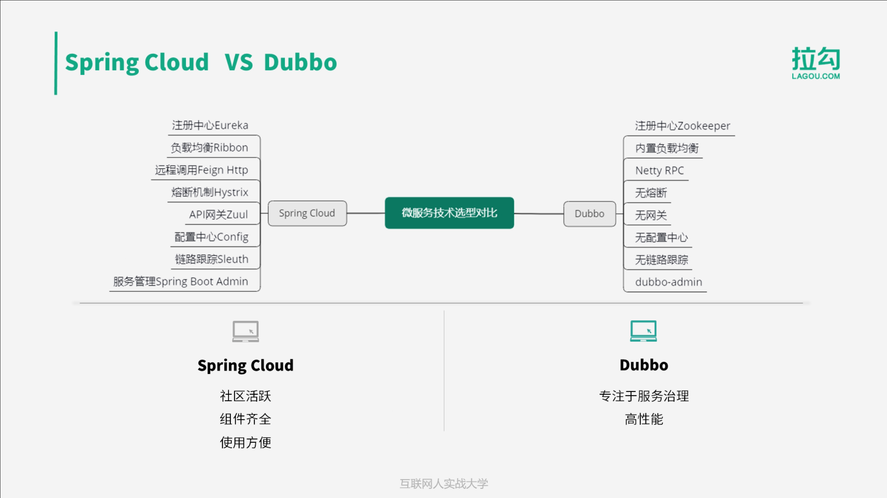

# 如何才能快速掌握SpringCloud

那么，如何才能快速掌握 Spring Cloud 呢？这里画了一张Spring Cloud的知识脑图，主要还是由Spring Cloud中的核心组件构成，包括：

- Eureka 主要用于服务治理；
- Ribbon 用于负载均衡；
- Hystrix 用于服务之间远程调用时的容错保护；
- Feign 可以让我们通过定义接口的方式直接调用其他服务的API；
- Zuul是API网关，是客户端请求的入口，负责鉴权，路由等功能；
- Gateway是新推出的基于Spring 5的响应式网关；
- Config用于统一的配置管理；
- Sleuth用于请求链路跟踪；
- Stream用来为微服务应用构建消息驱动能力。

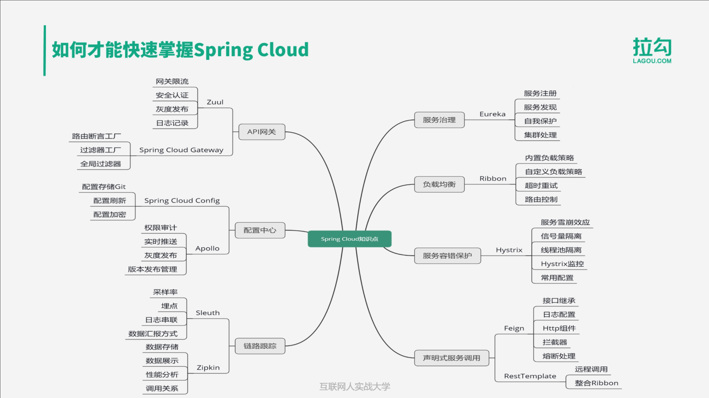

# 综合案例架构图

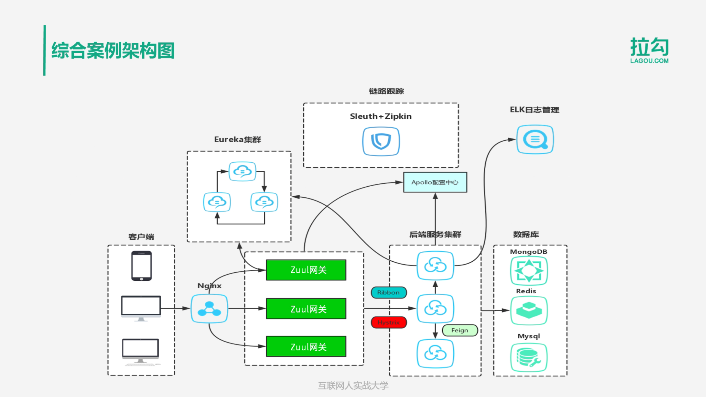

# 课程内容

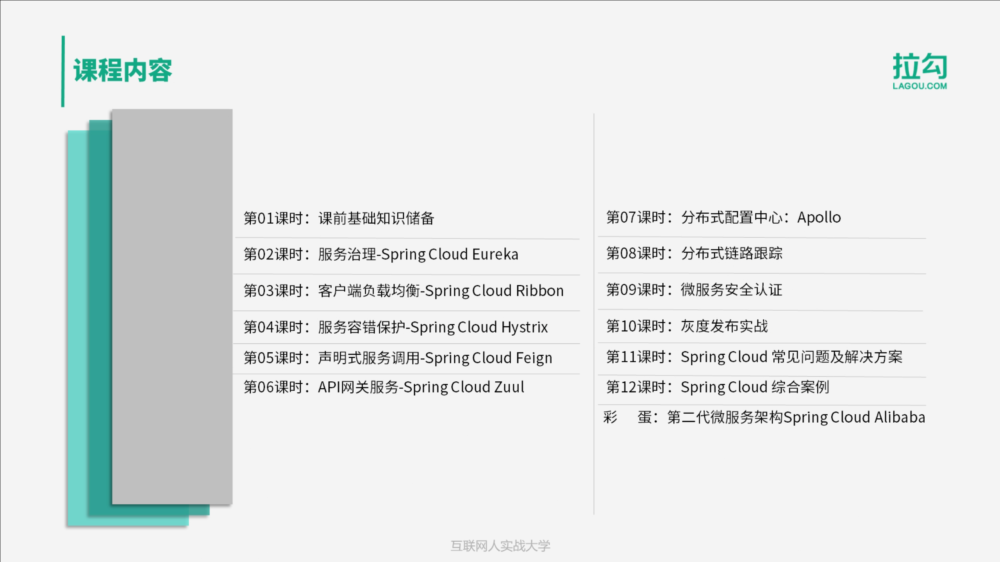

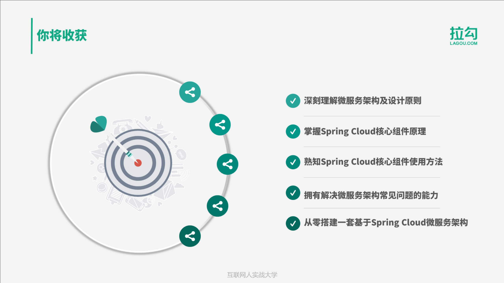

深刻理解微服务架构及设计原则

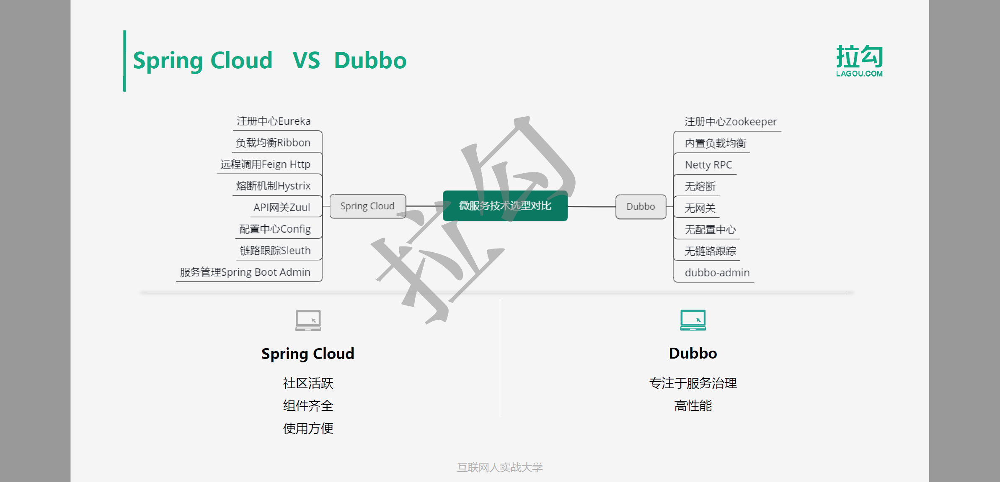

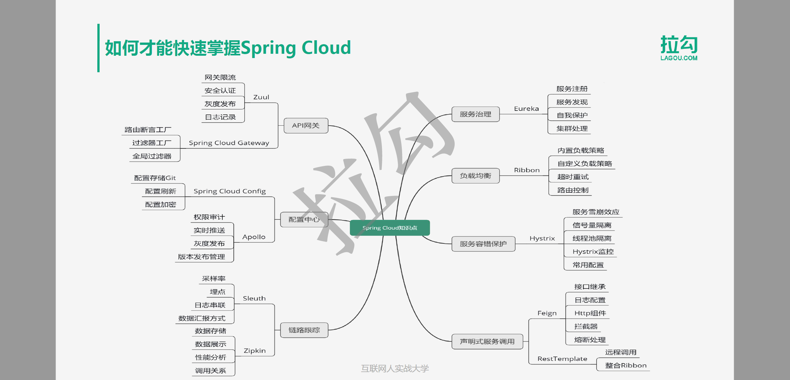

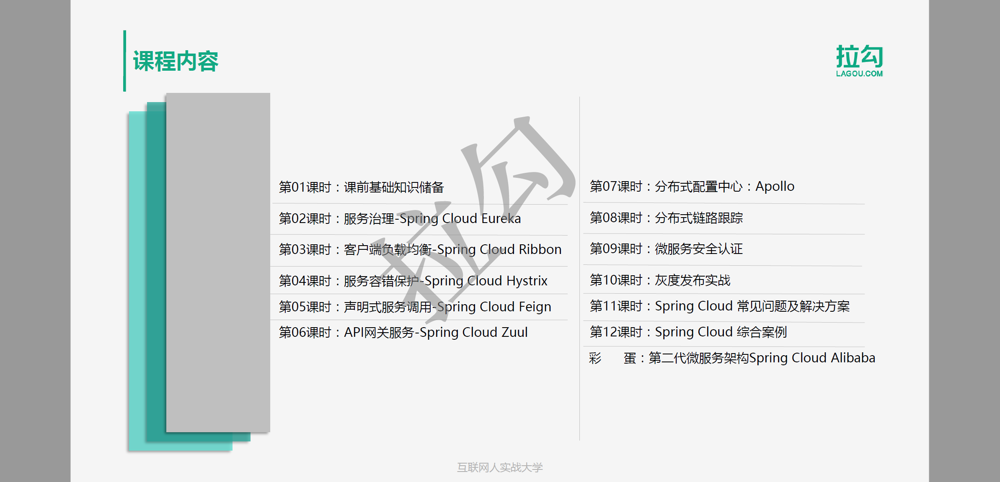

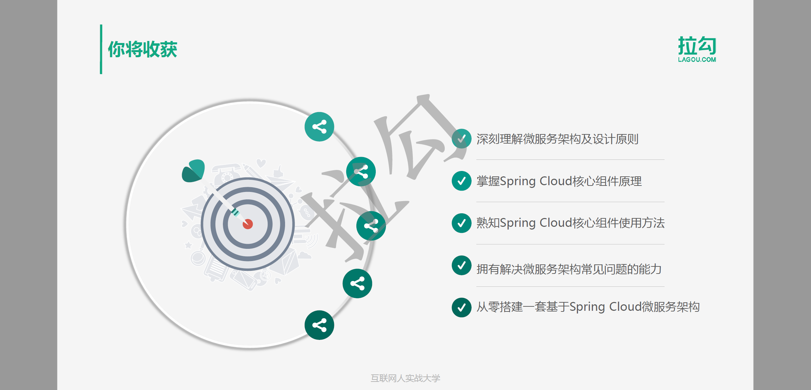

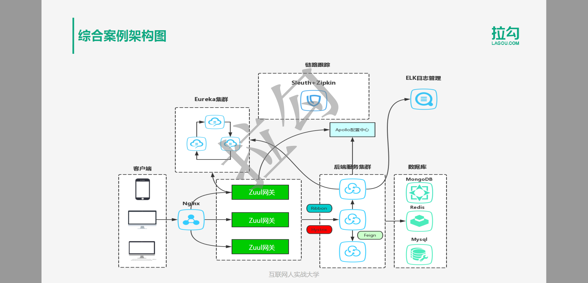

