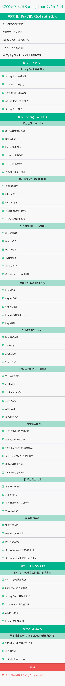

# 300分钟搞懂 Spring Cloud

Spring Cloud 微服务核心技术与实战

讲师：尹吉欢  资深 Java 技术专家

服务治理为何选择Spring Cloud
上次学习
第01讲：夯实基础-Spring Boot
第02讲：服务治理-Eureka
第03讲：客户端负载均衡-Ribbon
第04讲：服务容错保护-Hystrix
第05讲：声明式服务调用-Feign
第06讲：API网关服务-Zuul
第07讲：分布式配置中心-Apollo
第08讲：分布式链路跟踪
第09讲：微服务安全认证
第10讲：灰度发布实战
第11讲：Spring Cloud常见问题及解决方案
第12讲：Spring Cloud综合案例
彩蛋：第二代微服务架构Spring Cloud Alibaba

# 课程背景

最近几年，微服务架构一跃成为 IT 领域炙手可热的话题，像阿里巴巴、百度、美团等大厂，很早就已经开始了微服务的实践和应用。一线大厂的带动，让微服务成为了 Java 系程序员面试的必备考点。

Spring Cloud 作为所有微服务治理的优秀方案，其基于 Spring Boot 可实现快速集成，开发效率极高的特性，堪称中小型互联网公司的福音，更是技术未来的发展趋势。可以说不管你是什么级别，也不论你在什么公司，服务化都是你迟早要面对的难题。

但也正是简单易懂，开发者很容易忽视注解背后的底层技术。很多开发者仅看书籍或文档就可以快速上手，但在面试中和实际业务中，对底层技术实现几乎一无所知，对技术理解肤浅、缺少细节成为无数开发者的致命伤。

虽然 Spring Cloud 越来越火，文档、示例和技术博客也越来越丰富，但无法帮助开发者，解决更核心的技术底层逻辑误区。在学习的过程只能做到能用，确很难做到用好。

在《 300分钟搞懂 Spring Cloud 》中 ，作者根据自己多年的一线开发实战经验，总结了 12 个核心模块，包含 67 个必知必会知识点，共 300 分钟的视频课程，深入浅出帮你高效掌握 Spring Cloud 核心技术与实战技巧。

课程讲师
尹吉欢
资深 Java 技术专家

资深 Java 技术专家，微服务技术资深开发者。在 Spring Cloud 和微服务方面具有丰富的一线实战经验。

 

运营个人技术站”猿天地“，并活跃在各种技术大会上，分享自己的心得，还出版了《 Spring Cloud 微服务：入门、实战与进阶》和《 Spring Cloud 微服务：全栈技术与案例解析》两本图书。

学习收获
1. 深刻理解微服务架构及设计原则
2. 掌握 Eureka、Hystrix、API 网关等核心组件
3. 基于 Spring Cloud 进行实战案例拆解
4. 剖析微服务架构常见问题与解决方案
5. 从零搭建一套基于 Spring Cloud 的微服务架构

课程大纲

精选留言
**伟

4
之前自学了SpringBoot和SpringCLoud，遇到很多坑，也自己填了很多坑。 看完前期的课程后，有一种恍然大悟和温故而知新的感觉，对很多知识点有了新的认识， 同时Get到很多新的操作方式和技术点。
**岗

2
建议一些配置和实现应该写出来，动图手机上看不太清楚。谢谢老师，学习了。
编辑回复： 已反馈给讲师，后期我们会优化改进
**平

2
老师，能提供下项目的GitHub地址吗
编辑回复： https://github.com/yinjihuan/lagou-spring-cloud
**江

2
现在软件开发已经不是单机运行的时代，是云计算，人工智能，大数据处理的时代，作为一名开发人员应不断学习新知识，新技能，这门课系统详细的介绍了Spring cloud的相关知识，是学习高并发，高处理的一门好课，从浅入深，介绍全面，事例恰当，对今后的工作大有帮助！
*凯

2
里面的内容实用，技术点比较多，做为开发的专栏课很合适。
**军

1
课程质量很好，课程内容很细致，我可以好好的跟老师学习了。
**明

1
对系统学习微服务开发很有帮助，内容很全，非常棒…
**直

1
超级棒的课程！！！知识点讲的详详细细，而且讲的通俗易懂容易吸收，使我受益匪浅。非常感谢老师为我们提供了如此高质量的视频，希望老师能多出实战教程，一定出必买！
*晓

1
老师讲的很好，明明是很高深的东西，但是没有太多底子也能听的明明白白的，也有相当多的手记可以供查阅，目前看来，这堂课对于自己二刷三刷都是有可能的。第一次看编程课看的像高考一样充满斗志！
*猛

1
这个课程出的太及时了， 正好项目中需要用到SpringCloud相关的技术点， 所以借此时机进行大补一下； 在视频中学到很多干货， 灰常满意~~~
**南

1
老师讲的很好，干货满满，公司正好需要关于微服务安全方面的搭建，正是想睡觉了马上有人送枕头的感觉，太棒了，希望老师后续多出点课程。
**岗

明白健康检查的作用了
**岗

老师，课件的链接可以发下吗
编辑回复： 关注 拉勾教育 公众号 咨询小助手获取课件
hzhsb

案例案例代码在哪里，谢谢
编辑回复： 关注 拉勾教育 公众号 咨询小助手获取课件
**超

有源码吗？
编辑回复： 源码地址：https://github.com/yinjihuan/lagou-spring-cloud
**坤

老师讲的语速还有配置事项点很好，很期待结合案例的开讲，请问老师预讲什么时候更新？
编辑回复： 案例明天更新
**峰

终于看完了，老师讲的非常好，我也跟着做了一遍。一开始在网上看 Spring Cloud 介绍时，一堆相关概念和专业名词，搞的一头雾水。看了这个视频后，了解了一些相关概念，掌握了基本开发流程，相信对以后进一步学习微服务知识一定有很大的帮助。很棒