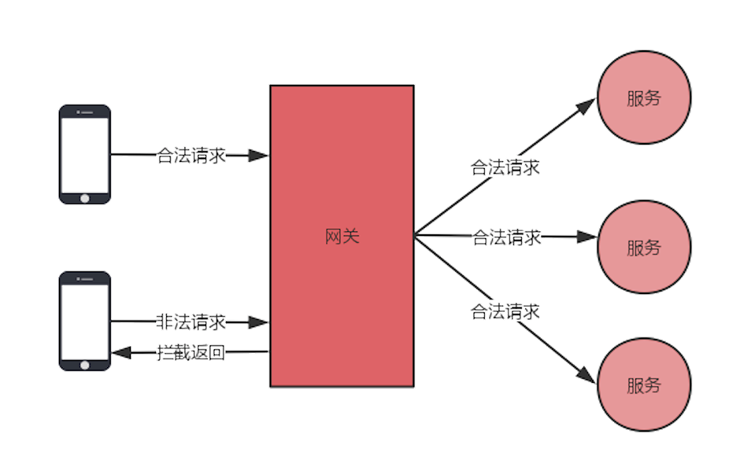
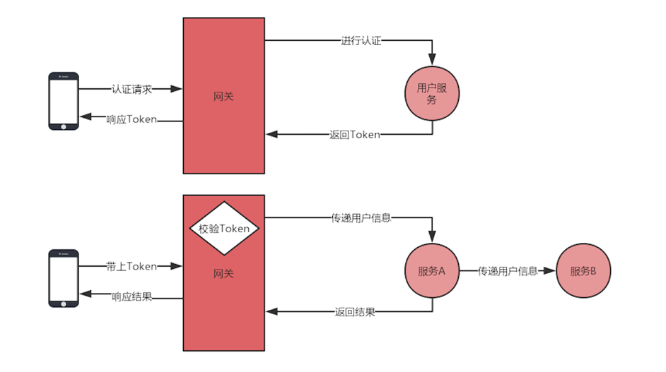
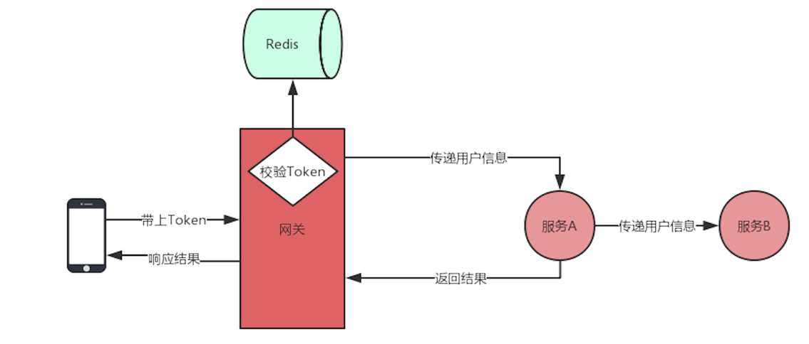
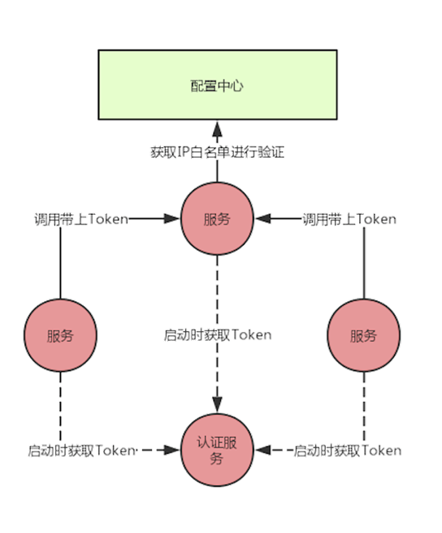

**第09讲：微服务安全认证**

2019/11/21 尹吉欢

本课时我们主要讲解服务器架构安全认证及常见的认证方式、JWT 认证、Token 的使用注意事项，以及内部服务之间的认证等内容。

# 微服务架构安全认证

随着单体应用架构到微服务架构的演进，应用的访问安全问题难度也在上升。为了适应微服务架构，安全认证的手段也在逐步提高。

    

在单体应用时，我们的应用是一个整体，请求会直接通过负载均衡器转发到后端，后端则会对所有的请求进行权限校验。当然也可以通过白名单的方式对一些请求进行放行，比如登录接口或与首页相关的一些接口。用户登录成功后将用户信息存储，请求时通过 sessionId 获取对应的用户信息，在拦截器或过滤器中进行访问权限的校验，然后判断是否有对应的权限，有权限的放行，无权限的拦截。

 

在微服务架构下，我们的应用会按一定的规则进行拆分，拆分后会有多个服务，每个服务都需要对访问进行鉴权，这无疑是一项很大的挑战。在微服务架构下通过鉴权机制将请求进行统一管理来解决这个问题，也就是所有的外部请求都经过网关来进行转发，这样就可以在网关中进行统一的权限控制。

# 常用的认证方式

常用的认证方式主要有三种：Session、HTTP Basic Authentication 和 Token。

## session

session 是认证中最常用的一种方式，也是最简单的。用户登录后将信息存储在后端，客户端则通过 Cookie 中的 SessionId 来标识对应的用户。

 

session 认证方式的最大优点是使用简单，但缺点也很明显：

1. 后端需要保存所有用户的登录信息，如果用户量非常大，服务端的存储压力也会增大。
2. 当项目部署多个节点后，通过负载均衡器进行转发，session 可能会出现丢失，比如用户 A 进行登录，这时请求是到 A 节点，会话信息存储在 A 节点，用户登录成功之后跳转到首页，这时首页的请求被转发到 B 节点，由于 B 节点没有用户 A 的会话信息，就造成了丢失的现象。

解决方案也有多种，比如 session 复制，Nginx 可以设置黏性 Cookie 来保证同一个用户的请求只访问同一个节点，还有就是 session 集中式存储，最常见的就是存储在 Redis 中。

## HTTP Basic Authentication

HTTP Basic Authentication 也就是 HTTP 基本认证，它是 HTTP 1.0 提出的一种认证机制。HTTP 基本认证的原理是客户端在请求时会在请求头中增加 Authorization，Authorization 是用户名和密码用 Base64 加密后的内容。服务端获取 Authorization Header 中的用户名与密码进行验证。

## Token

Token 方式和 HTTP Basic Authentication 类似，但和 session 不同，session 只是一个 key，会话信息存储在后端。而 Token 中会存储用户的信息，然后通过加密算法进行加密，只有服务端才能解密，服务端拿到 Token 后进行解密获取用户信息。

# JWT 认证

## JWT 认证简介

JWT（JSON Web Token）是为了在网络应用环境中传递声明而执行的一种基于 JSON 的开放标准。JWT 的声明一般被用在身份提供者和服务提供者间传递被认证的用户身份信息， 以便从资源服务器获取资源。

 

比如在用户登录时，基本思路就是用户提供用户名和密码给认证服务器，服务器验证用户提交信息的合法性；如果验证成功，会产生并返回一个 Token，用户可以使用这个 Token 访问服务器上受保护的资源。

 

JWT 由三部分构成：

- 第一部分是头部（Header）；
- 第二部分是消息体（Payload）；
- 第三部分是签名（Signature）。

一个 JWT 生成的 Token 格式为：

```
token = encodeBase64(header) + '.' + encodeBase64(payload) + '.' + encodeBase64(signature)
```

头部的信息通常由两部分内容组成，令牌的类型和使用的签名算法，比如下面的代码：

```
{ "alg": "HS256", "typ": "JWT" }
```

消息体中可以携带一些应用需要的信息，比如用户 ID，代码如下： 

```
{ "id": "1234567890", "name": "John Doe"}
```

签名是用来判断消息在传递的路径上是否被篡改的，从而保证数据的安全性，格式如下： 

```
HMACSHA256( base64UrlEncode(header)  + "." +  base64UrlEncode(payload), secret)
```

通过这三部分就组成了我们的 JSON Web Token。

## JWT 认证流程

使用 JWT 来生成 Token 进行认证，首先客户端需要调用服务端提供的认证接口来获取 Token。获取 Token 的流程如图所示，客户端会首先发起一个认证的请求到网关，网关会将请求转发到后端的用户服务中，在用户服务中验证身份后，就会根据用户的信息生成一个 Token 返回给客户端，这样客户端就获取了后面请求的通行证。

    

然后，客户端会将获取的 Token 存储起来，在下次请求时带上这个 Token，一般会将 Token 放入请求头中进行传递。当请求到达网关后，会在网关中对 Token 进行校验，如果校验成功，则将该请求转发到后端的服务中，在转发时会将 Token 解析出的用户信息也一并带过去，这样在后端的服务中就不用再解析一遍 Token 获取的用户信息，这个操作统一在网关进行的。如果校验失败，那么就直接返回对应的结果给客户端，不会将请求进行转发。

 

下面我们来实现 JWT 的认证流程，首先需要创建一个认证的服务，这个服务中提供认证的 API。这里为了方便演示，就不再讲解具体的逻辑了，直接返回验证成功，用户 ID 为 1。

 

验证成功后需要生成 JWT Token，生成方式这里封装了一个 JWTUtils 的工具类，提供了获取 Token 的方法并检查 Token 是否有效。生成 Token 的方法有多种，可以根据不同参数来生成，可以只传递用户 ID，也可以指定 Token 的有效时间。在检查有效的方法里会返回检查结果，是 Token 过期了，还是非法的 Token 等信息。

 

JWT Token 的算法使用的是 RSA 算法，代码参考 RSAUtils。JWT 相关的依赖用的是 io.jsonwebtoken 下的 JJWT 包。

 

也就是说客户端想要调用后端的 API，那么必须先调用认证的接口获取 Token，问题是第一次请求肯定是没有 Token 信息的，所以我们需要在网关中对某些 API 进行白名单配置，进行放行，这个可以结合配置中心来做。

 

最重要的是认证的这个 API 不能进行校验，否则就会进入死循环。在网关中，验证过滤器会对 /oauth/token 这个 API 进行放行，不进行验证。然后判断请求有没有带 Token，如果没有就直接拦截，返回友好的提示信息。

 

如果带了 Token 那么就使用之前封装好的工具类来检查 Token 是否有效，无效则拒绝，有效才则进行放行。并且将解析出的用户 ID 添加到请求头中，传递给后端服务。到此为止，整个认证的流程结束，你会发现自己实现一套认证的机制也并不复杂。

# 用户信息的全局传递扩展

在网关中验证请求的合法性，合法就从 JWT 中解析用户 ID，这时需要将用户 ID 传递给后端服务，之所以要传递是因为同样的工作没必要重复做，既然网关中已经做了，就直接使用网关处理好的结果即可。

 

既然要将用户信息传递给后端服务，那么必须要在接口中增加参数，通过参数进行传递，后端服务接收后调用其他服务时也是通过参数进行传递。这种方式没什么问题，但不够优雅，所有要用到的接口都要增加参数。

 

最简单的方案是不需要加任何参数，不需要改变任何现有的代码，直接通过请求头进行传递，在服务内部通过 ThreadLocal 进行上下文传递，完全不需要定义参数。

 

主要的流程是从网关传递到后端服务，后端服务接收数据后存储到 ThreadLocal 中，服务会调用其他服务，如果用 Feign 调用可以利用 Feign 的拦截器传递数据，如果用 RestTemplate 的拦截器传递数据也是一样，下面来看看具体怎么实现全局信息的传递。

 

在 Aticle 服务中可以直接通过 HttpServletRequest 从请求头中获取刚刚传递的用户 ID。接着使用 RestTemplate 调用 user 服务，这个时候怎么将用户 ID 传递给 user 服务呢？

可以通过 RestTemplate 的拦截器来实现，在拦截器中会获取上下文中的数据，同时添加到请求头中，这样 user 服务也可以通过请求头获取到 UID。

 

RequestContext 需要实现一个通用的过滤器来接收调用方传递过来的 UID，然后存储起来，这样在拦截器中才可以获取的到 HttpHeaderParamFilter 中的 UID，然后保存。在 BeanConfiguration 中配置过滤器即可生效。

 

在正常情况下，我们用 ThreadLocal 来传递信息没有问题，前面的课时中有讲到如果用 Hystrix 的线程隔离方式，ThreadLocal 就会失效，解决方案也已经讲过了，这边就不再赘述，原理就是重新注册 Hystrix 的并发插件，对 Callable 进行装饰，传递需要的数据。我们把代码定义在 auth-common 中，为了是能够复用，在使用的项目中只需要手动配置就可以使用了。

# Token 的使用

## Token 注销

Token 使用最大的问题在于如何注销，当我们生成一个 Token 后，这个 Token 的有效期是存储在 Token 本身中的，只有解析出 Token 的信息，才能获取到 Token 的有效时间，但却不能修改。

    

为了防止出现 Token 的安全性问题，我们需要根据业务场景去设置合理的过期时间，总之，Token 的有效期越短，安全性就越高，安全性问题指的是被非法份子盗取了 Token 后进行异常操作。

 

除了设置合理的过期时间之外，还可以在用户退出登录时，进行 Token 的注销操作，刚刚也讲到了 Token 信息是不能被修改的，所以只能通过将注销的 Token 放入 Redis 中进行一层过滤，来达到注销的效果。也就是在网关中验证 Token 的有效性时先从 Redis 中判断这个 Token 是否存在，如果存在，则直接拦截，证明这个 Token 已经被注销了。

 

这里需要注意的是 Token 放入 Redis 的过期时间的设置，一般会设置成 Token 剩余的有效时间，比如 Token 还有 2 个小时就过期了，当用户注销时，就将 Token 存储在 Redis 中，失效时间就设置成 2 小时。如果在 2 个小时之内，这个 Token 被再次使用，那么 Redis 中有值，就会被拦截掉，如果过了 2 个小时，Redis 中的缓存也就失效了，这个时候 Token 本身也过期了，也会被拦截，通过增加外部存储的方式来达到注销的效果。

 

使用 Token 是为了让服务无状态，也就是不依赖外部存储。如果使用 Session 来进行验证的话，用户信息是存储在服务端的，会通过 SessionId 来获取对应的用户信息，如果是集群部署，就需要进行 Session 共享，验证时也需要查询 SessionId 是否存在，然后才能做出正确的处理，这时验证依赖了其他组件。

 

Token 将用户信息和过期时间都存储在自身信息中，通过加密算法来保证安全性，解密也只依赖算法和指定的解密 Key 即可。这样在服务扩容时也比较方便，这里通过 Redis 来进行一层过滤，其实就打破了不依赖其他组件的原则，但这个问题还能接受，Redis 本身性能极高，其次验证的逻辑只存在网关中，并不是所有服务都需要去读取 Redis 来验证 Token。

## Token的安全使用建议

关于 Token 的安全使用，给你几点建议：

- 设置较短（合理）的过期时间。

Token 的有效期越短，安全性越高，如果一个 Token 的有效期是一年，那么这个 Token 被非法份子获取后，就可以使用一年。

- 注销的 Token 及时清除（放入 Redis 中做一层过滤）。

这个在前面讲过了，我们不能修改 Token 的信息，只能在验证层面做一层过滤来进行处理。

- 监控 Token 的使用频率。

如果你做过反爬虫会有感触，就是为了防止数据被别人爬取，需要有一系列的监控手段，最常见的就是监控使用频率，正常的用户操作和用程序写出来的爬虫程序肯定是不一样的。 

- 核心功能敏感操作可以使用动态验证（验证码）。

对于一些核心的功能，可以进行再次验证，这个跟产品的设计有关系，比如提现的功能，我们会要求在提现时再次进行验证码的验证，防止不是本人操作。

- 网络环境、浏览器信息等识别。

如果你有使用过手机银行 APP 就会知道，银行 APP 对环境有很高的要求，有时你在使用时断网了，APP 会自动退出，让你重新登录，因为网络环境跟之前使用的不一样了，然后还有一些浏览器的信息之类的判断，其实这些都是可以用来保证后端 API 的安全。

- 加密密钥支持动态修改。

如果 Token 的加密密钥泄露了，也就意味着别人可以伪造你的 Token，这时建议将密钥存储在配置中心，以支持动态修改刷新，需要注意的是一但密钥发生了变化，就意味着之前的所有 Token 都会失效，这时需要告诉客户端重新进行 Token 申请。建议在流量低峰的时候去做更换的操作，否则 Token 全部失效，所有在线的请求都会重新申请 Token，并发量会比较大。

# 内部服务之间的认证

前面讲的都是外部请求的认证，对于内部服务之间的认证，我们可以做也可以不做。内部服务肯定是在内部的网络环境下，不开放公网 IP 外部是无法访问的，一般来说内部服务之间的调用都不需要进行验证。

    

如果非要做验证，我们可以基于 IP 白名单来实现，比如用户服务只能某些 IP 或者 IP 段访问，IP 白名单可以采用配置中心来存储，具备实时刷新的能力。

 

采用 IP 白名单的方式也比较简单，工作量不大，不好的点在于 IP 不能随便变动。当一个服务新加了节点后，需要手动配置白名单，当然也可以集成在发布工具中，发布的时候会自动刷新涉及的白名单。

 

既然外部能用 Token 来验证，那么内部同样也可以使用 Token 来进行验证，服务在启动时就可以在统一的认证服务中申请 Token, 申请需要的认证信息可以放在配置中心。这样服务在启动后就有了能够访问其他服务的 Token，在调用的时带上 Token，被调用的服务中进行 Token 的校验即可。

 

对于 Token 的失效更新，可以采取两种方式，一种是在请求时如果返回的 Token 已失效，那么可以重新获取 Token 后再发起调用，这种在并发量大时需要加锁处理，不然会发生同时申请多个 Token 的情况。

 

另外一种就是采用定时更新的方式，比如 Token 是 1 个小时的有效期，那么定时任务就 可以 50 分钟更新一次，这样在请求时就不用考虑过期问题。


 

00:00

 300分钟搞懂 Spring Cloud

 